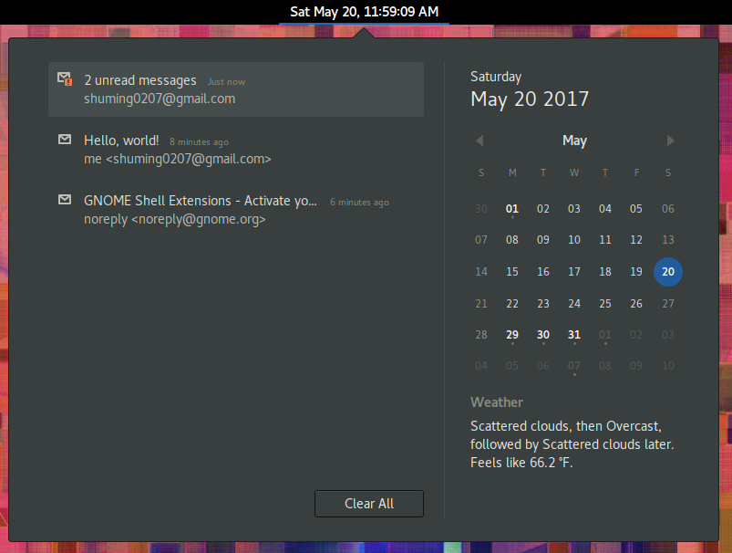

# Gnome Email Notifications

Utilizes Gnome Online Accounts to login to Gmail/Outlook and check your incoming email

## Installation

1. Install gnome-shell version 3.22 or later.

2. Sign in with your Google and/or Microsoft account in Gnome Online Accounts settings.

3. Either install from https://extensions.gnome.org/extension/1230/gmail-message-tray/
OR
run `git clone --depth 1 https://github.com/shumingch/gnome-email-notifications ~/.local/share/gnome-shell/extensions/GmailMessageTray@shuming0207.gmail.com`

## Screenshot

## Troubleshooting

1. For any errors, try rebooting or signing back in to your Gnome Online Accounts. 

## Authors

Shuming Chan <shuming0207@gmail.com>

