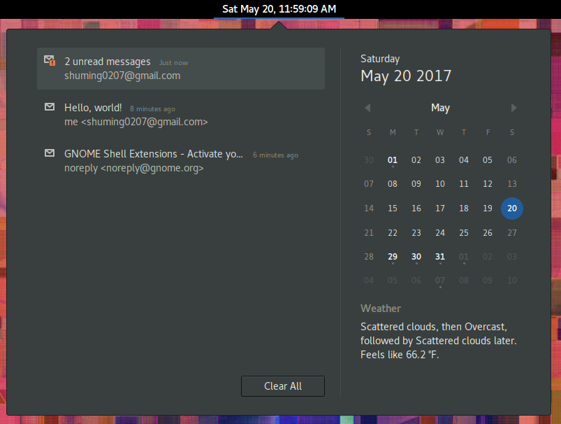

# Gnome Email Notifications

Utilizes Gnome Online Accounts to login to Gmail/Outlook and check your incoming email.

## Features
- Gmail and Outlook (Microsoft 365) support via GNOME Online Accounts (GOA).
- Native GNOME Shell notifications with message tray integration.

## Installation

1. Install gnome-shell version 45 or later.
2. Install `gir1.2-goa` (GNOME Online Accounts GObject Introspection):
   ```bash
   sudo apt install gir1.2-goa-1.0
   ```
3. Sign in with your Google and/or Microsoft account in **GNOME Settings > Online Accounts**.
4. Either install from [GNOME Extensions](https://extensions.gnome.org/extension/1230/gmail-message-tray/) OR local install:
   ```bash
   git clone https://github.com/shumingch/gnome-email-notifications ~/.local/share/gnome-shell/extensions/GmailMessageTray@shuming0207.gmail.com
   ```

## Contributing

We welcome contributions! Here is how to get started:

### Repository Structure
- `extension.js`: Main entry point for the extension.
- `EmailAccount.js`: Manages GOA accounts and orchestrates scanners/notifiers.
- `InboxScanner.js`: Logic for scanning both Gmail and Outlook.
- `Notifier.js`: Handles opening URLs and managing notification state.
- `NotificationFactory.js`: Low-level GNOME Shell notification creation.
- `Conf.js`: Settings management.
- `tests/`: Extensive unit test suite with mocks.
- `scripts/`: Development utility scripts.

### Development Workflow
1. **Setup**: Clone the repo.
2. **Testing**: We use a custom mocking framework to test logic without a full GNOME Shell environment.
   ```bash
   gjs -m tests/run_tests.js
   ```
   Copy the output to your extensions folder.
```bash
   sudo rm -rf ~/.local/share/gnome-shell/extensions/GmailMessageTray@shuming0207.gmail.com
   sudo ln -s "$PWD" ~/.local/share/gnome-shell/extensions/GmailMessageTray@shuming0207.gmail.com
```
   ```
3. **Packaging**: Use the provided script to create a production-ready zip (excludes tests/CI/etc).
   ```bash
   ./scripts/zip.sh
   ```

### Troubleshooting & Logs
- **Journal Logs**: See logs:
  ```bash
  journalctl | grep "Gnome Email Notifications"
  ```
  or 
  ```bash
  journalctl | grep "GmailMessageTray"
  ```
- **Reset Settings**: If you're having issues, you can reset the extension's settings to their defaults:
  ```bash
  dconf reset -f /org/gnome/shell/extensions/gmailmessagetray/
  ``` 

## Screenshot



## License
GPL-2.0-or-later
